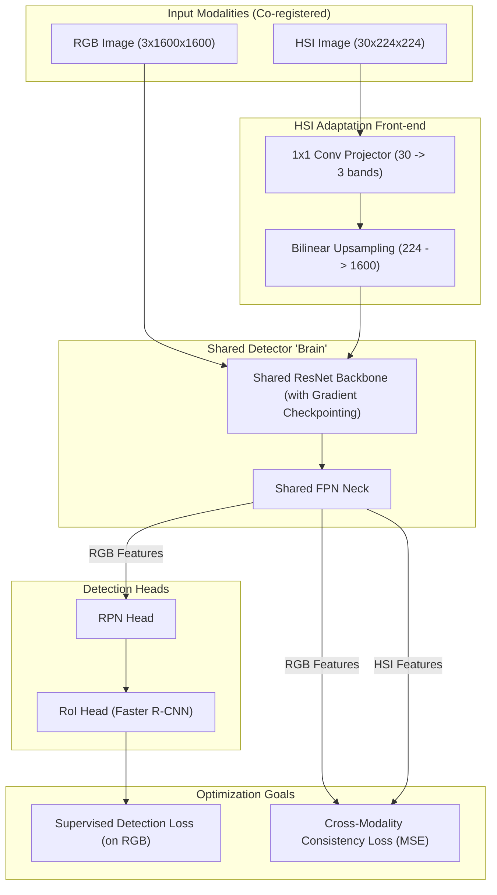

# JOHDA: Joint Optical-Hyperspectral Domain Adaptation Architecture

This document describes the internal architecture of the `JointModalityDetector` and the Cross-Modality Consistency (CMC) training strategy.

## 1. High-Level Concept
JOHDA adapts a pre-trained RGB object detector to the hyperspectral (HSI) domain by training on co-registered image pairs. It uses a shared backbone and neck to align the features of both modalities.

## 2. Component Roles

### HSI Projector & Upsampler
*   **Role**: Translates raw hyperspectral bands into a 3-channel "latent RGB" representation and matches the spatial resolution of the RGB domain.
*   **Initial State**: Initialized with spectral band-averaging weights (R=53, G=32, B=11).
*   **Target**: Optimized to produce features that "fool" the shared backbone into thinking it's seeing RGB.

### Shared Backbone & Neck
*   **Role**: These layers are the soul of the detector. By sharing them, we ensure that both modalities are mapped into the **exact same feature space**.
*   **Optimization**: They are updated by both the detection loss (to remain accurate) and the consistency loss (to remain modality-agnostic).

### Cross-Modality Consistency (CMC)
*   **Formula**: `loss_consistency = MSE(features_rgb, features_hsi)`
*   **Intuition**: Since the RGB and HSI images show the same ship at the same location, their features at the end of the FPN neck must be identical. This loss "pulls" the HSI representation toward the known-good RGB representation.

## 3. Training vs. Inference

| Feature | Training Phase | Inference (Testing) Phase |
| :--- | :--- | :--- |
| **Inputs** | RGB + HSI (Co-registered) | HSI Only |
| **Backbone** | Bi-directionally updated | Fixed (Inference mode) |
| **Losses** | Detection + Consistency | None (Output BBoxes) |
| **Purpose** | Aligning Modalities | Detecting Objects in HSI |
