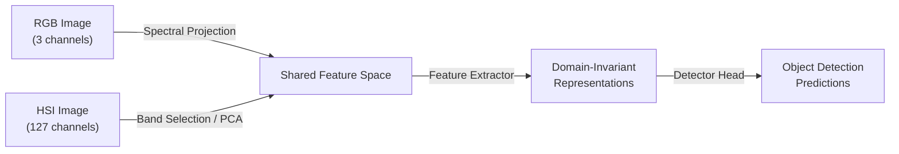
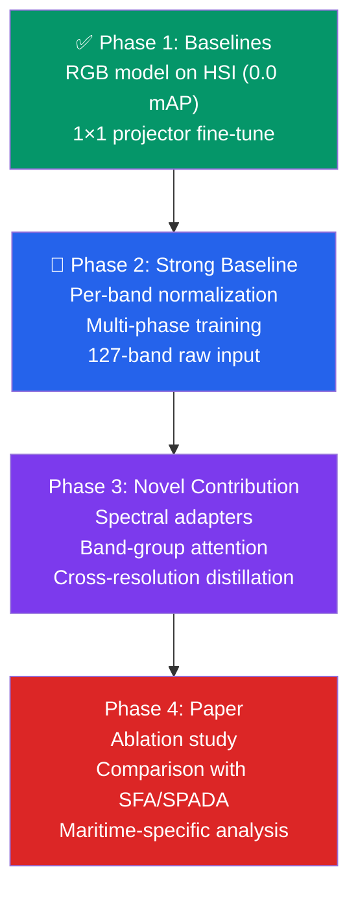

# Cross-Modality Domain Adaptation: RGB → Hyperspectral Imagery

> **Scope**: State-of-the-art methods (2023–2026), design recommendations, research gaps, and practical tips for achieving near-SOTA performance on the M2SODAI dataset (maritime object detection with synchronized RGB + HSI aerial pairs).

---

## 1. Method Categories & Representative Works

### 1.1 Adversarial Domain Adaptation

Adversarial methods train a domain discriminator alongside a feature extractor, forcing the learned features to be domain-invariant.

| Method | Year | Key Idea |
|--------|------|----------|
| **BiDA** (Bi-directional DA) | 2025 | Triple-branch transformer (source, target, coupled) with Coupled Multi-head Cross-Attention (CMCA). Extracts domain-invariant + domain-specific features simultaneously. |
| **CCGDA** (Class-aligned Class-balancing Generative DA) | 2024 | Generative adversarial approach with class-aligned adversarial loss; addresses class imbalance in HSI datasets. |
| **DADAnet** (Domain-aware Adversarial Augmentation) | 2026 | Single-domain generalization via progressive adversarial domain augmentation for cross-scene HSI. |
| **HT-UDANet** (Hybrid Training UDA) | 2025 | Combines self-training with adversarial feature alignment for HSI classification. |

**How they handle spectral–spatial heterogeneity:**
- Multi-branch architectures separate spectral vs. spatial feature streams before adversarial alignment
- Domain discriminators operate at multiple feature scales (image-level + feature-level)
- Class-conditional alignment prevents mode collapse when categories have different spectral signatures

**Limitations:**
- Training instability from the minimax game
- May align features globally but miss fine-grained spectral band correspondences
- Large spectral dimensionality mismatch (3 vs. 100+ channels) can overwhelm the discriminator

---

### 1.2 Feature Alignment (Discrepancy Minimization)

These methods minimize statistical divergence (MMD, CORAL, Wasserstein) between source and target feature distributions.

| Method | Year | Key Idea |
|--------|------|----------|
| **SFA** (Spectral-Spatial Feature Alignment) | 2024 | First HSI cross-domain object detection method; aligns spectral-spatial features between source/target. |
| **SPADA** (Spectral Prototype Attention DA) | 2025 | Dual prototype banks + distance-based posterior modeling; attention-guided spectral-spatial backbone. |
| **RDFA** (Reconstruction Discrepancy & Feature Alignment) | 2025 | Open-set DA combining domain-level adversarial adaptation with class-level centroid alignment. |
| **Prototype-Based Inter-Intra Domain Alignment** | 2024 | IGARSS 2024; unsupervised cross-scene HSI classification through prototype alignment. |

**How they handle spectral–spatial heterogeneity:**
- Prototype-based methods learn per-class spectral anchors, naturally capturing spectral structure
- Multi-level alignment (pixel → patch → image) captures both spatial context and spectral detail
- Attention mechanisms dynamically weight informative spectral bands during alignment

**Limitations:**
- MMD/CORAL assume similar data distributions—severe modality gap (RGB→HSI) may violate this
- Prototype methods sensitive to noisy pseudo-labels in early training
- Cannot handle structural differences in feature dimensions without a spectral projection module

---

### 1.3 Domain Disentanglement

These methods decompose representations into domain-invariant (content) and domain-specific (style/modality) components.

| Method | Year | Key Idea |
|--------|------|----------|
| **FDGNet** (Frequency Disentanglement) | 2024 | Frequency-domain separation for cross-scene HSI classification; synthesizes domains preserving semantic consistency. |
| **Causal Disentanglement for HSI DG** | 2024 | Views different sensing scenes as causal interventions; decouples domain-specific and domain-invariant factors. |
| **SDE** (Spectral Disentanglement & Enhancement) | 2025 | Partitions feature dimensions into strong signals, weak signals, and noise for robust multimodal representations. |
| **DA via Spatial-Spectral Domain Separation** | 2024 | HSI fusion via spatial-spectral domain separation for domain adaptation. |

**How they handle spectral–spatial heterogeneity:**
- Explicit separation of spectral (band-wise) and spatial (texture/shape) features
- Cross-domain reconstruction losses ensure disentangled representations are meaningful
- Causal approaches formalize domain shift as interventions, providing theoretical grounding

**Limitations:**
- Disentanglement is under-constrained without strong inductive biases
- Computational overhead of maintaining separate encoders/decoders
- Difficult to guarantee complete separation of content and style

---

### 1.4 Contrastive Learning

Self-supervised and supervised contrastive learning methods that learn domain-invariant representations by pulling same-class/same-content pairs together and pushing different ones apart.

| Method | Year | Key Idea |
|--------|------|----------|
| **SSCL** (Spatial-Spectral Contrastive Learning) | 2024 | Defines contrastive task across spatial and spectral views of the same HSI sample. |
| **XDCL** (Cross-Domain Contrastive Learning) | 2024 | Unsupervised HSI representations by aligning features valuable for category identification across spectral/spatial domains. |
| **MTLDA** (Multi-Task Learning DA) | 2025 | Dual-domain contrastive learning: source supervised CL + target unsupervised CL for cross-scene HSI. |
| **DiffCRN** (Diffusion Contrastive Representation Network) | 2025 | Combines DDPM with contrastive learning; spatial self-attention + spectral group self-attention. |
| **S²GCL** (Spectral-Spatial Feature Graph CL) | 2024 | Lightweight graph CL leveraging spatial structure and spectral similarity matrices for HSI clustering. |

**How they handle spectral–spatial heterogeneity:**
- Cross-view contrastive pairs (spatial view vs. spectral view) force models to learn modality-agnostic representations
- Prototype-based contrastive methods provide robust class-center anchoring across domains
- Graph-based methods capture non-Euclidean spectral relationships

**Limitations:**
- Negative pair selection is critical and hard to optimize with severe domain gap
- Requires careful augmentation design for HSI (standard RGB augmentations don't transfer directly)
- Computationally expensive memory banks for large HSI datasets

---

### 1.5 Diffusion / Generative Models

Diffusion models and GANs for spectral image generation, reconstruction, and domain translation.

| Method | Year | Key Idea |
|--------|------|----------|
| **DDSR** (Degradation-Aware Diffusion for Spectral Reconstruction) | 2024 | Models HSI→RGB degradation to guide inverse RGB→HSI reconstruction. |
| **ULDM** (Unobservable Feature Latent Diffusion Model) | 2025 | Extends RGB pre-trained LDMs to model unobservable spectral features; integrates spectral + spatial knowledge. |
| **CASSIDiff** (Conditional Diffusion for Spectral Compressive Imaging) | 2025 | Conditional diffusion for hyperspectral snapshot reconstruction. |
| **Conditional Diffusion for HSI Synthesis** | 2024 | RGB-conditioned diffusion to generate diverse hyperspectral remote sensing imagery. |

**How they handle spectral–spatial heterogeneity:**
- Model the forward degradation process (HSI→RGB) explicitly, learning the inverse as spectral reconstruction
- Latent diffusion operates in compressed spectral space, making high-dimensional generation tractable
- Can generate paired RGB↔HSI data for training, alleviating data scarcity

**Limitations:**
- Very high computational cost (inference and training)
- Generated HSI may lack physical fidelity for downstream detection tasks
- Quality degrades for rare spectral signatures not well-represented in training

---

### 1.6 Transformer-Based Approaches

Vision transformers adapted for spectral sequence modeling and cross-domain feature extraction.

| Method | Year | Key Idea |
|--------|------|----------|
| **BiDA Transformer** | 2025 | Semantic tokenizer + CMCA for bi-directional domain feature alignment. |
| **SST-ATL** (Spatial-Spectral Transformer Active Transfer Learning) | 2025 | Integrates SST with active learning; dynamic layer freezing + self-calibrated attention. |
| **HSD²Former** (Hybrid-Scale Dual-Domain Transformer) | 2024 | Crisscrossed interaction for joint global + multiscale spectral-spatial feature extraction. |

**How they handle spectral–spatial heterogeneity:**
- Self-attention captures long-range spectral dependencies (band-to-band correlations)
- Spatial-spectral dual-branch transformers process both dimensions in parallel
- Tokenization strategies (patch, band, or hybrid tokens) control granularity of spectral processing

**Limitations:**
- Quadratic complexity w.r.t. sequence length (problematic for full-resolution HSI)
- Pre-training data scarcity in spectral domain (no ImageNet equivalent for HSI)
- May not capture local spectral features as well as 1D convolutions

---

---

## 2. How Methods Handle the RGB→HSI Spectral–Spatial Gap

The core challenge in your setting is the **extreme modality gap**: RGB has 3 bands, HSI has 100+ bands, and spatial resolutions often differ.



### Common Strategies

| Strategy | Description | Your Current Implementation |
|----------|-------------|-----------------------------|
| **Spectral Projection** (1×1 conv) | Learns a linear mapping from N HSI bands → 3 RGB-like channels | ✅ `ProjectUpsampleResNet` with 1×1 conv |
| **Band Selection** | Selects HSI bands closest to RGB spectral response (R≈53, G≈32, B≈11 for M2SODAI) | ✅ Explored in `find_best_hsi_bands.py` |
| **PCA Compression** | Reduces HSI dimensionality while preserving variance | ✅ 30-channel PCA variant tested |
| **Spectral Reconstruction** | Generates synthetic HSI from RGB via diffusion/GAN | ❌ Not yet explored |
| **Shared Backbone with Adapters** | Inserts adapter layers into a pre-trained RGB backbone to handle extra bands | ❌ Not yet explored |
| **Cross-Attention Fusion** | Attends to relevant HSI bands conditioned on RGB features | ❌ Not yet explored |

---

## 3. Limitations of Current Approaches

> [!WARNING]
> These limitations are particularly relevant for the RGB→HSI detection setting on M2SODAI.

1. **Most DA methods assume homogeneous input spaces.** RGB (3ch) → HSI (127ch) violates this assumption. A projection layer is essential but introduces an information bottleneck.

2. **Classification vs. Detection gap.** The vast majority of HSI DA literature focuses on pixel-level classification, not bounding-box detection. Detection requires spatial reasoning (RPN, anchors, feature pyramids) that classification methods ignore.

3. **Spatial resolution mismatch.** HSI sensors typically have lower spatial resolution. Upsampling artifacts (your `target_size=(1600,1600)`) can confuse detectors.

4. **Limited paired datasets.** M2SODAI is one of very few synchronized RGB+HSI detection datasets. Methods cannot easily leverage large-scale pre-training.

5. **Small object sensitivity.** Maritime objects (ships, floating matter) are often small; pseudo-label methods tend to miss them due to low confidence.

6. **No established baselines for RGB→HSI OD adaptation.** Unlike natural image DA (Cityscapes→FoggyCityscapes), there is no standardized benchmark protocol.

---

## 4. Design Recommendations for a Strong Baseline

Based on your current progress (RGB Faster R-CNN → HSI with 1×1 projector) and the literature:

### Architecture

```
HSI Input (127 bands)
    │
    ├─→ [1×1 Conv Projector] → 3-ch pseudo-RGB → Pre-trained ResNet-50 backbone
    │        ↑ Initialize with band-selection weights (R=53, G=32, B=11)
    │        ↑ Add BatchNorm + optional learnable residual
    │
    ├─→ [Spectral Feature Branch] → 1D conv over spectral dim → auxiliary spectral features
    │        ↑ Concatenate or cross-attend with backbone features at FPN level
    │
    └─→ FPN → RPN → RoI Head → Detection
```

| **Phase 1**: Projector warm-up | Train 1×1 conv + BN only on HSI → RGB mapping | Backbone + Head | 1e-3 | 5–10 |
| **Phase 2**: Full fine-tune | Unfreeze everything, train end-to-end | — | 1e-4 | 30–50 |

### Key Hyperparameters

- **Projector init:** Band-selection weights (not random) — you already do this ✅
- **Learning rate:** Use cosine annealing with warm-up (500 iters)
- **Input resolution:** Match RGB training resolution; avoid extreme upsampling of HSI

---

## 5. Novel Research Directions & Identified Gaps

> [!IMPORTANT]
> These represent concrete opportunities for a publishable contribution.

### 5.1 Spectral-Aware Adapter Modules (High Impact)
**Gap:** Current methods use a simple 1×1 projection, discarding most spectral information before the backbone.

**Proposed idea:** Insert lightweight **spectral adapter modules** at each ResNet stage that inject spectral features (from a parallel 1D-conv branch over the raw HSI bands) into the backbone via channel attention or cross-attention. This preserves spectral information throughout the feature hierarchy without retraining the backbone from scratch.

### 5.2 Diffusion-Based RGB↔HSI Translation for Data Augmentation (High Impact)
**Gap:** No existing work uses diffusion models to generate paired RGB↔HSI training data specifically for object detection.

**Proposed idea:** Train a conditional diffusion model on the M2SODAI paired data to generate synthetic HSI from RGB (and vice versa). Use the synthetic pairs to augment training data and improve projector pre-training.

### 5.3 Band-Group Attention + Progressive Spectral Expansion
**Gap:** 127→3 projection is lossy. No gradual spectral narrowing exists.

**Proposed idea:** Instead of a single 1×1 conv, use a cascade: 127→32→8→3, where each stage uses grouped convolutions + attention over band groups. Train with progressive unfreezing.

### 5.5 Cross-Resolution Feature Distillation
**Gap:** HSI spatial resolution is often lower; detection suffers on small objects.

**Proposed idea:** Use the high-resolution RGB detector as a teacher. Distill spatial features from the RGB branch into the HSI branch, conditioning on spectral features to preserve material-specific information at higher spatial resolution.

### 5.6 Multi-Task Detection + Material Classification
**Gap:** HSI's spectral richness is underutilized in pure bounding-box detection.

**Proposed idea:** Add an auxiliary head for per-pixel or per-RoI material classification (water, ship hull, floating debris). The spectral features needed for material ID will regularize the backbone to preserve spectral information, improving detection robustness under challenging sea surface conditions.

---

## 6. Practical Tips

### 6.1 Data Preprocessing

| Aspect | Recommendation |
|--------|---------------|
| **Band selection** | Use your optimized bands (R=53, G=32, B=11) for the projection init. For the full pipeline, keep all 127 bands. |
| **Normalization** | Per-band z-score normalization: compute mean/std per band across the training set. Avoid simple 0–1 scaling (loses inter-band contrast). |
| **Dead band removal** | Remove bands with near-zero variance or known atmospheric absorption (water vapor ~940nm, ~1140nm, ~1380nm). Check M2SODAI's spectral range. |
| **Spatial alignment** | Verify pixel-level registration between RGB and HSI. M2SODAI provides synchronized pairs, but sensor parallax may exist at object edges. |
| **Data format** | Load raw `.mat` files, not PCA-compressed versions, for maximum spectral information. Convert to memory-mapped `.npy` for speed. |

### 6.2 Normalization Strategies

```python
# Per-band z-score (recommended)
mean = hsi_train.mean(axis=(0, 2, 3))  # shape: (127,)
std = hsi_train.std(axis=(0, 2, 3))    # shape: (127,)
hsi_normalized = (hsi - mean[None, :, None, None]) / (std[None, :, None, None] + 1e-6)

# For the 1x1 projector output, match ImageNet normalization
# so the pre-trained backbone sees familiar value ranges
imagenet_mean = [0.485, 0.456, 0.406]
imagenet_std = [0.229, 0.224, 0.225]
```

### 6.3 Augmentation

| Augmentation | Works for HSI? | Notes |
|-------------|----------------|-------|
| Random horizontal/vertical flip | ✅ Yes | Apply identically to all bands |
| Random crop + resize | ✅ Yes | Apply spatially to all bands |
| Color jitter | ⚠️ Careful | Only apply to the 3-ch projected output, not raw HSI |
| Mixup / CutMix | ✅ Yes | Apply across spatial dims; spectral mixing is physics-valid |
| Spectral dropout | ✅ Novel | Randomly zero out 10–30% of bands during training for regularization |
| Band permutation | ❌ No | Destroys spectral ordering |
| Gaussian noise (per-band) | ✅ Yes | Simulates sensor noise; use band-specific variance |

### 6.4 Training Tricks

1. **Gradient checkpointing** — Essential for full 127-band HSI at high resolution (you already use this ✅)
2. **Mixed precision (AMP)** — Safe for detection; watch for NaN in projector BN layers
3. **Freeze BN in backbone** — When fine-tuning with small batch size, freeze BN stats from ImageNet
4. **Warm-up the projector** — Train only the 1×1 conv for a few epochs before unfreezing the backbone
5. **EMA model** — Use exponential moving average of weights for evaluation (0.9999 decay)
6. **Multi-scale training** — Randomly sample input scale from {800, 1000, 1200, 1400, 1600}
7. **Label smoothing** — Use 0.1 label smoothing in the classification head to improve calibration
8. **Larger batch with accumulation** — Effective batch size of 8–16 via gradient accumulation

### 6.5 Evaluation Protocol

- **Primary metric:** mAP@IoU=0.50 (COCO-style) — consistent with M2SODAI paper
- **Per-class AP:** Report ship vs. floating matter separately
- **Ablation baselines:**
  - Lower bound: RGB model tested directly on band-selected HSI (no adaptation) — you have this (0.0 mAP)
  - Mid bound: 1×1 projector fine-tuned end-to-end — your current work
  - Upper bound: Model trained natively on HSI from scratch — target to beat

---

## 7. Recommended Reading List

### Must-Read Papers

1. **M2SODAI** (NeurIPS 2023 Datasets) — Your dataset paper; establishes DoubleFPN baseline
2. **SFA: Spectral-Spatial Feature Alignment for HSI Cross-Domain OD** (Nov 2024) — First cross-domain HSI detection
3. **SPADA: Spectral Prototype Attention DA** (Nov 2025) — SOTA HSI DA with prototype banks
4. **BiDA: Bi-directional Domain Adaptation** (2025) — Triple-branch transformer DA framework
5. **DDSR: Degradation-Aware Diffusion for Spectral Reconstruction** (Jul 2024) — Diffusion for RGB→HSI
6. **ULDM: Unobservable Feature Latent Diffusion** (Jul 2025) — Extends RGB pre-trained LDMs to HSI
7. **EigenSR: Bridging RGB and HSI Super-Resolution** (2025) — Eigenimage-based spectral transfer
8. **FDGNet: Frequency Disentanglement for HSI DG** (2024) — Domain generalization via frequency separation
9. **DiffCRN: Diffusion Contrastive Representation Network** (2025) — DDPM + contrastive for HSI

### Survey Papers

- "Diffusion Models for Hyperspectral Image Processing: A Survey" (May 2025)
- "Hyperspectral Image Classification: Evolution from CNNs to Transformers and Mamba" (2025)
- "Cross-Modality Object Re-identification" (Mar 2026)

---

## 8. Summary: Your Roadmap



> [!TIP]
> Your most impactful next step is **Phase 2**: establish a strong supervised baseline with raw 127-band HSI, proper per-band normalization, and multi-phase training. This gives you a solid number to beat and compare against in your paper.
